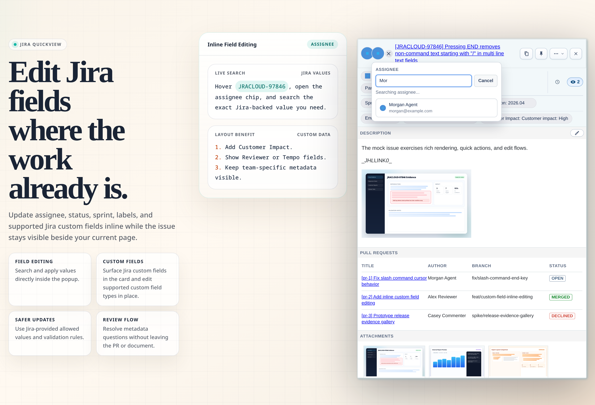
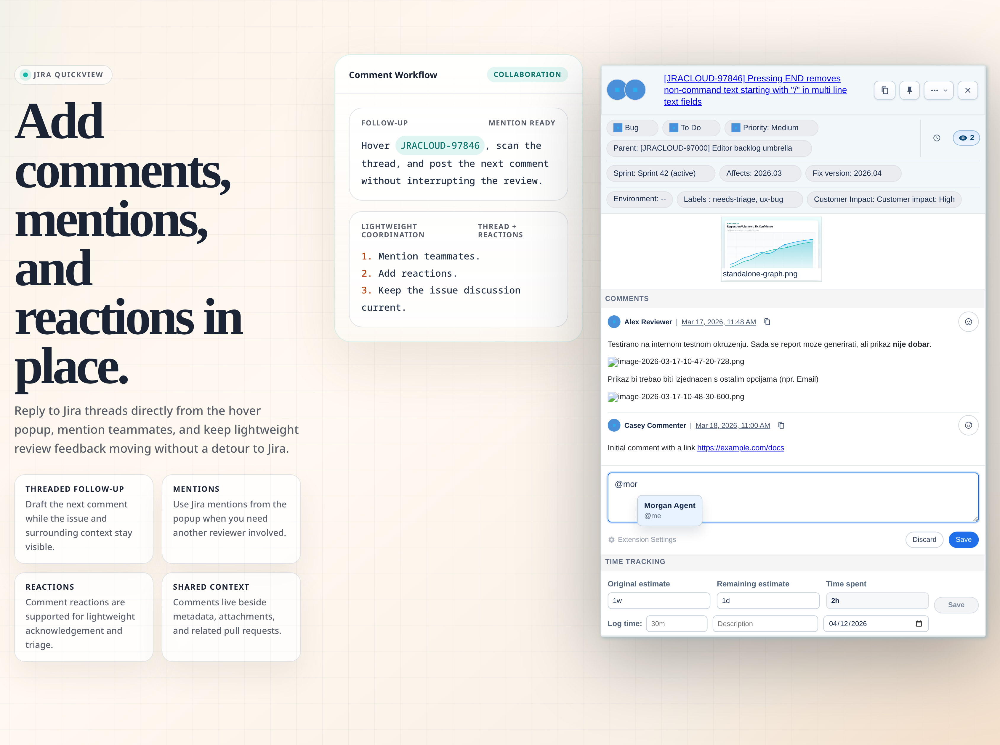
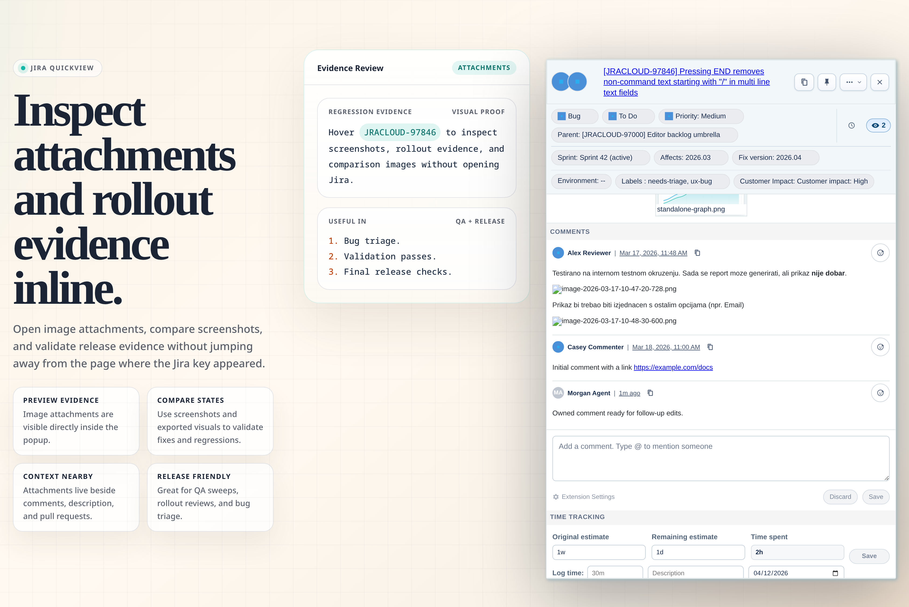
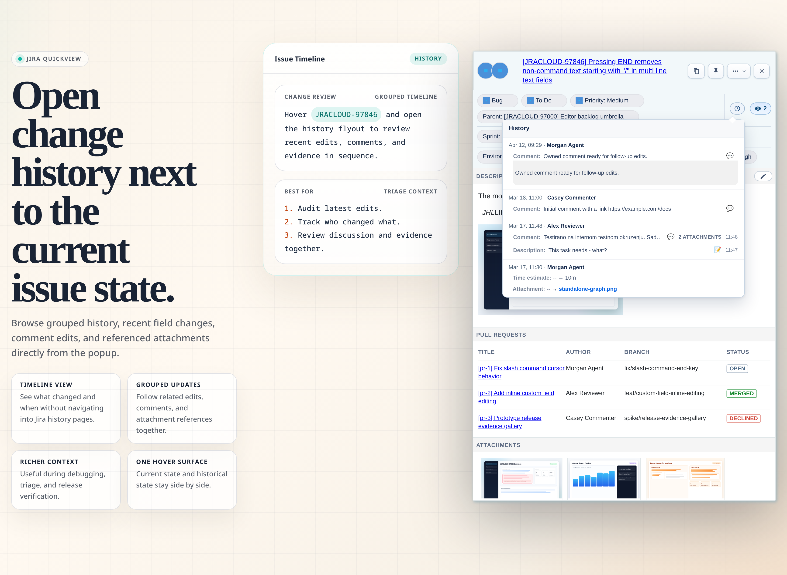
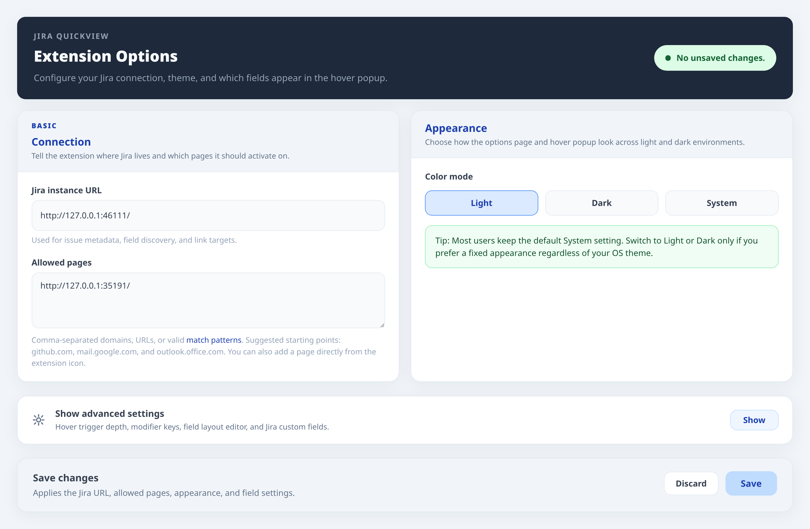
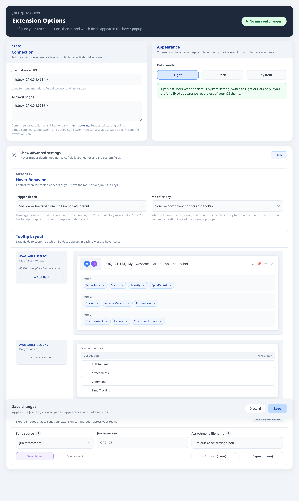
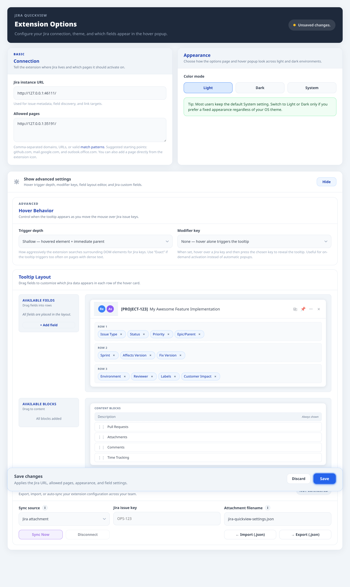

# Jira QuickView

> Hover Jira keys on GitHub, Gmail, Outlook, docs, and other enabled pages to inspect issues, follow linked PRs, comment, transition, and edit fields without opening a new Jira tab.

[Download Extension](https://chromewebstore.google.com/detail/jira-quickview/oddgjhpfjkeckcppcldgjomlnablfkia) · [Extension website](https://dgebaei.github.io/Jira-QuickView/) · [User guide](docs/user-guide.md) · [GitHub repository](https://github.com/dgebaei/Jira-QuickView) · [Issue tracker](https://github.com/dgebaei/Jira-QuickView/issues)

## One hover, much more context

Open a Jira notification email in Gmail or Outlook, hover the issue key in the message, and triage the ticket directly from your inbox. The same workflow applies on GitHub pull requests, release notes, docs, bug lists, and other enabled pages: inspect the issue, review linked PRs, add comments, transition status, and update fields without breaking context.

## Feature highlights

- Action Jira email notifications directly from Gmail, Outlook, and other enabled inbox-style pages
- Rich popup for issue metadata, description, attachments, comments, and linked pull requests
- PR visibility inside the card, including title, author, branch, and status
- Inline editing for supported Jira fields and supported custom field types
- Configurable layout with Jira custom fields placed directly into the popup rows
- Comment drafting with mentions and support for comment reactions
- Jira-backed quick actions and workflow transitions

## Why it matters

- Turns Jira notification emails into actionable workflows instead of another tab-switching detour
- Less tab switching during review and triage
- Faster issue updates while staying in the current page
- Better release confidence with attachments, history, and linked PRs in one place
- More relevant popups because each team can control fields and custom field placement

## Quick start

1. Open [Download Extension](https://chromewebstore.google.com/detail/jira-quickview/oddgjhpfjkeckcppcldgjomlnablfkia) in the Chrome Web Store.
2. Click `Add to Chrome` and confirm the browser prompt.
3. Open the Jira QuickView Options page.
4. Enter your Jira instance URL, for example `https://your-company.atlassian.net`.
5. Add the pages where Jira QuickView should run, such as `github.com`, `mail.google.com`, or `outlook.office.com`.
6. Save, open an allowed page, and hover a Jira issue key such as `ABC-123`.

By default, the popup opens when you hover a Jira key and then hold `Alt`, `Ctrl`, or `Shift`. This keeps busy pages readable while still making issue details one gesture away.

For full setup details, advanced allowed-page patterns, desktop-app/PWA setup notes, custom fields, troubleshooting, and day-to-day workflows, read the [User guide](docs/user-guide.md).

## Where it works

Jira QuickView works on pages you explicitly allow, including GitHub, Gmail, Outlook on the web, internal docs, wiki pages, dashboards, release notes, and QA checklists. It does not scan every site you visit.

## Customize the popup

The Options page lets you choose color mode, hover behavior, row fields, content blocks, custom Jira fields, and import/export settings. The [User guide](docs/user-guide.md) explains each configuration block and the Jira permission or workflow limits behind edit controls.

## Privacy

- Uses your existing Jira browser session
- Stores no separate Jira password
- Sends requests from the browser to your Jira instance
- Honors Jira permissions, validation rules, and workflow restrictions
- [Privacy Policy](https://dgebaei.github.io/Jira-QuickView/privacy-policy.html)

## Need help?

- Read the [User guide](docs/user-guide.md) for setup, advanced configuration, troubleshooting, and daily workflows.
- Use the [Issue tracker](https://github.com/dgebaei/Jira-QuickView/issues) to report bugs or request improvements.

## Gallery

| Quick actions | Inline editing |
| --- | --- |
|  |  |

| Description editing | Comment drafting |
| --- | --- |
|  |  |

| Attachments and evidence | Related pull requests |
| --- | --- |
|  |  |

| Change history | Options overview |
| --- | --- |
|  |  |

| Advanced layout | Custom fields |
| --- | --- |
|  |  |

## License

MIT. See `LICENSE.md`.
