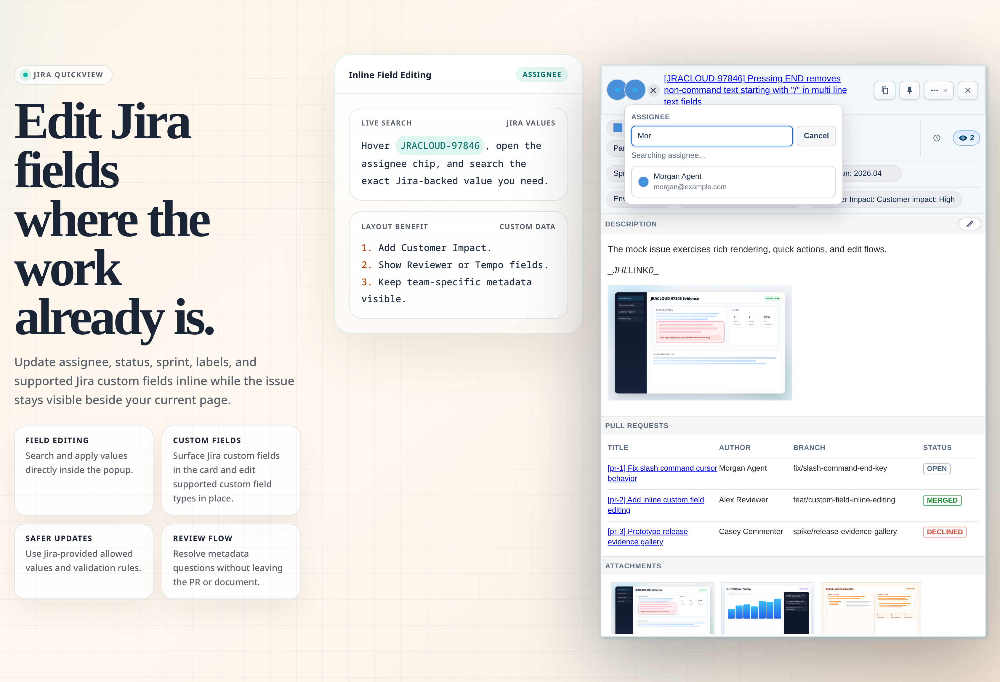
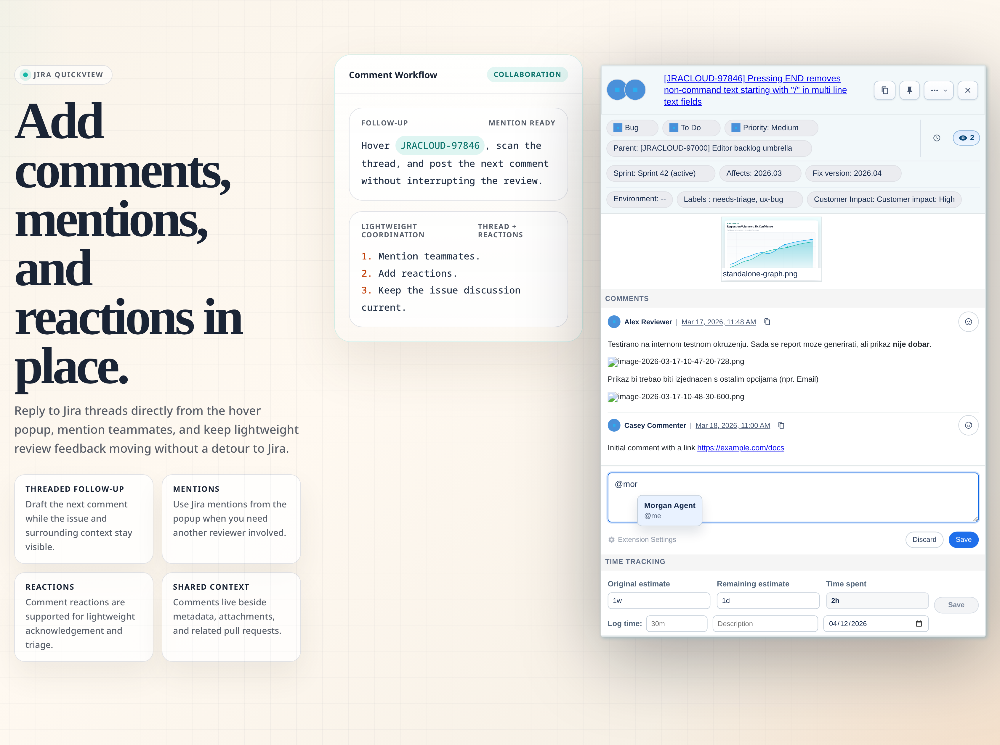
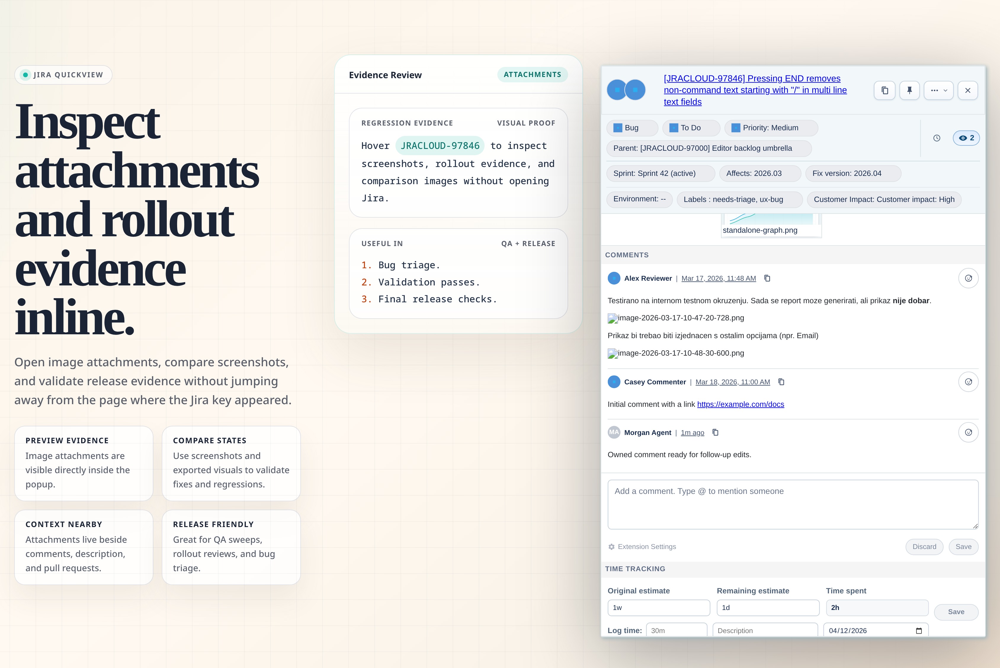
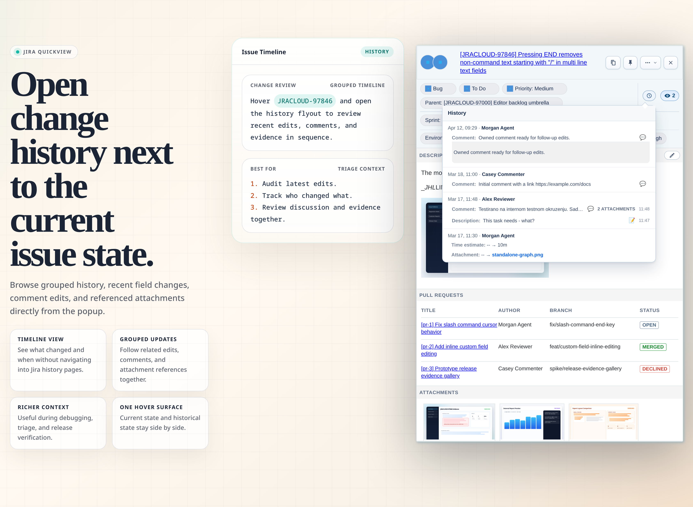
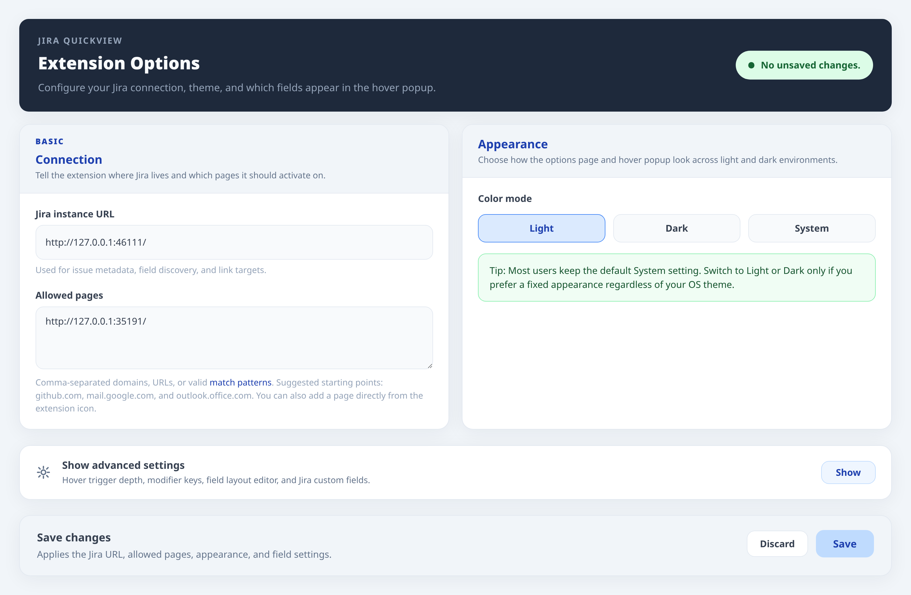
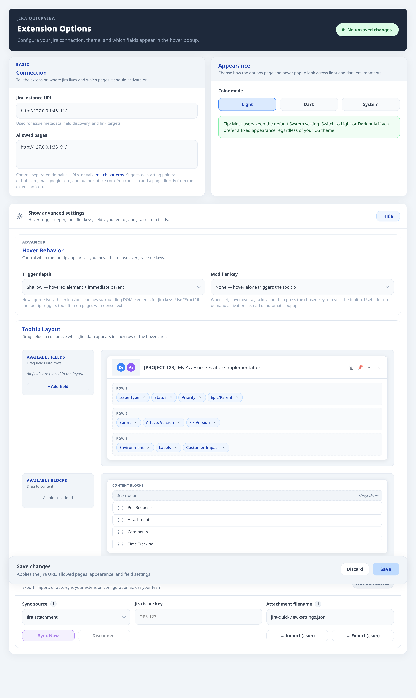
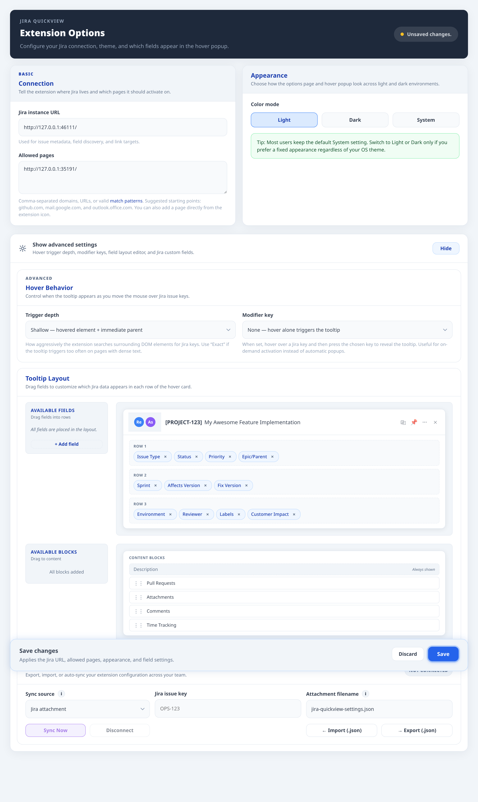

# Jira QuickView

> Click Jira issue links or hover recognized keys on GitHub, Gmail, Outlook, docs, and other enabled pages to inspect and update issues without opening another Jira tab.

[Download Extension](https://chromewebstore.google.com/detail/jira-quickview/oddgjhpfjkeckcppcldgjomlnablfkia) · [Extension website](https://dgebaei.github.io/Jira-QuickView/) · [User guide](docs/user-guide.md) · [GitHub repository](https://github.com/dgebaei/Jira-QuickView) · [Issue tracker](https://github.com/dgebaei/Jira-QuickView/issues)

## One gesture, much more context

Open a Jira notification email in Gmail or Outlook, click the issue link, and triage the ticket directly from your inbox. The same workflow applies on GitHub pull requests, release notes, docs, bug lists, and other enabled pages: inspect the issue, review linked PRs, add comments, transition status, and update fields without breaking context.

## Feature highlights

- Action Jira email notifications directly from Gmail, Outlook, and other enabled inbox-style pages
- Rich popup for issue metadata, linked Jira issues, description, attachments, comments, and linked pull requests
- Linked-issue management grouped by relationship, with key/summary search, multi-key entry, status and assignee context, and confirmed removal
- PR visibility inside the card, including title, author, branch, and status
- Inline editing for supported Jira fields and supported custom field types
- Configurable layout with Jira custom fields placed directly into the popup rows
- Comment drafting with mentions and support for comment reactions
- Jira-backed quick actions and workflow transitions
- Copy rich issue links beside Jira references in Jira and on allowed pages

## What's new in 2.8.0

- Plain-click Jira links open a pinned QuickView by default, while automatic hover preview keeps working for Jira IDs that are not links
- Field editing now keeps its own Jira metadata, search, selection, save, retry, and stale-response handling; picker edits save when you click away
- Linked issues can be searched, added in batches, grouped by relationship, and removed with confirmation
- Comment drafts, mentions, pasted-image uploads, reactions, edit/delete flows, focus, and error recovery remain stable across permitted rerenders
- Attachments are enabled for new installations and show both image previews and downloadable non-image files
- Copy controls work across allowed pages and dynamic Jira views, including search results, boards, side panels, comments, linked issues, and dropdowns
- Popup loading, positioning, caching, refreshes, avatars, light-theme selection states, and preservation of open work are more resilient

## Why it matters

- Turns Jira notification emails into actionable workflows instead of another tab-switching detour
- Less tab switching during review and triage
- Faster issue updates while staying in the current page
- Better release confidence with linked issues, attachments, history, and linked PRs in one place
- More relevant popups because each team can control fields and custom field placement

## Quick start

1. Open [Download Extension](https://chromewebstore.google.com/detail/jira-quickview/oddgjhpfjkeckcppcldgjomlnablfkia) in the Chrome Web Store.
2. Click `Add to Chrome` and confirm the browser prompt.
3. Open the Jira QuickView Options page.
4. Enter your Jira instance URL, for example `https://your-company.atlassian.net`.
5. Add the pages where Jira QuickView should run, such as `github.com`, `mail.google.com`, or `outlook.office.com`.
6. Save, open an allowed page, and click a Jira issue link such as `ABC-123`.

By default, a plain left click on a Jira issue link opens and pins QuickView instead of navigating, while hovering previews Jira IDs that are not links. Middle-click and modifier-click retain normal browser behavior. Hover preview can be disabled or require a modifier in Advanced settings.

For full setup details, advanced allowed-page patterns, desktop-app/PWA setup notes, custom fields, troubleshooting, and day-to-day workflows, read the [User guide](docs/user-guide.md).

## Where it works

Jira QuickView works on pages you explicitly allow, including GitHub, Gmail, Outlook on the web, internal docs, wiki pages, dashboards, release notes, and QA checklists. It can add copy actions beside recognized Jira references on those pages and across supported Jira Cloud or Jira Data Center views. It does not scan every site you visit.

## Customize the popup

The Options page lets you choose color mode, click and hover activation, row fields, content blocks, custom Jira fields, and import/export settings. The [User guide](docs/user-guide.md) explains each configuration block and the Jira permission or workflow limits behind edit controls.

## Privacy

- Uses your existing Jira browser session
- Stores no separate Jira password
- Sends requests from the browser to your Jira instance
- Honors Jira permissions, validation rules, and workflow restrictions
- [Privacy Policy](https://dgebaei.github.io/Jira-QuickView/privacy-policy.html)

## Need help?

- Read the [User guide](docs/user-guide.md) for setup, advanced configuration, troubleshooting, and daily workflows.
- Use the [Issue tracker](https://github.com/dgebaei/Jira-QuickView/issues) to report bugs or request improvements.

## Gallery

| Linked issue management | Multi-key linking |
| --- | --- |
|  |  |

| Quick actions | Inline editing |
| --- | --- |
|  |  |

| Description editing | Comment drafting |
| --- | --- |
|  |  |

| Attachments and evidence | Related pull requests |
| --- | --- |
|  |  |

| Change history | Options overview |
| --- | --- |
|  |  |

| Advanced layout | Custom fields |
| --- | --- |
|  |  |

## License

MIT. See `LICENSE.md`.
