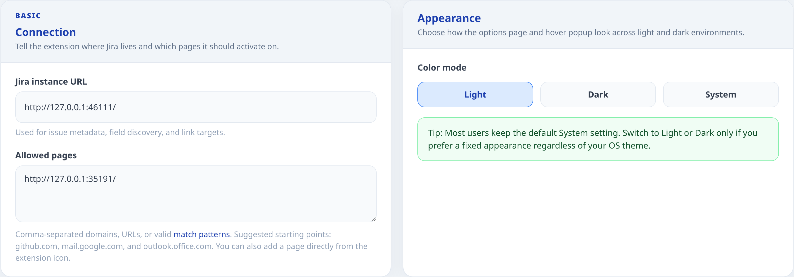
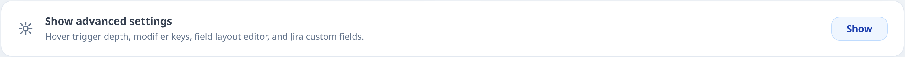
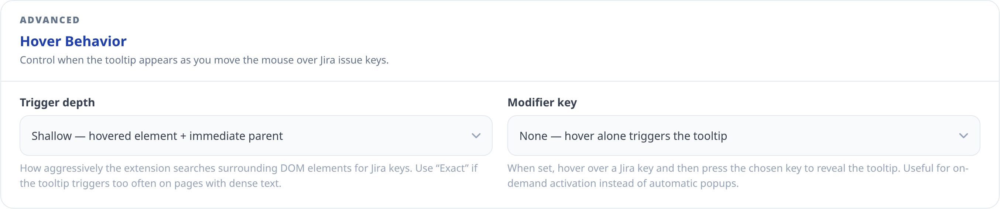
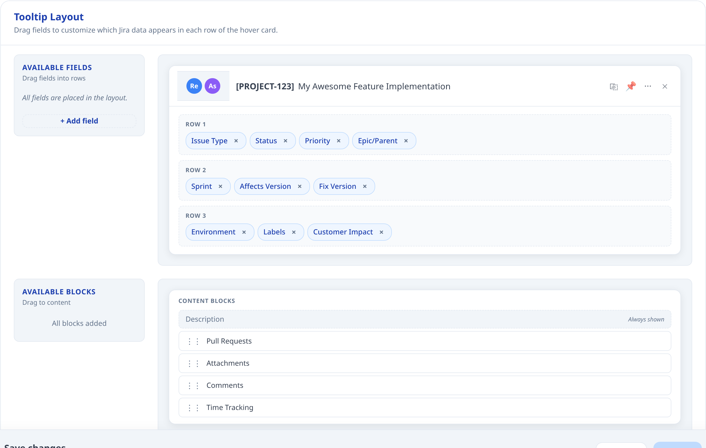
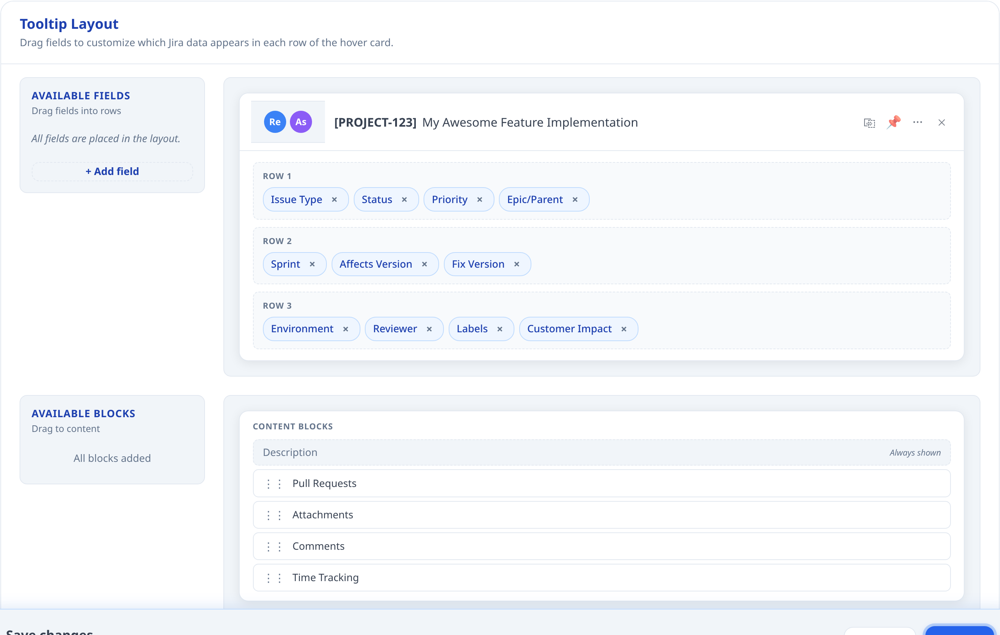
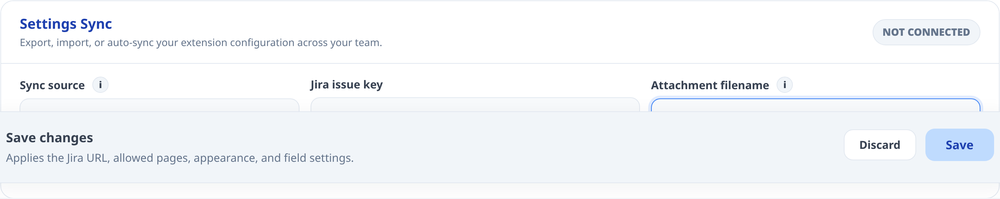
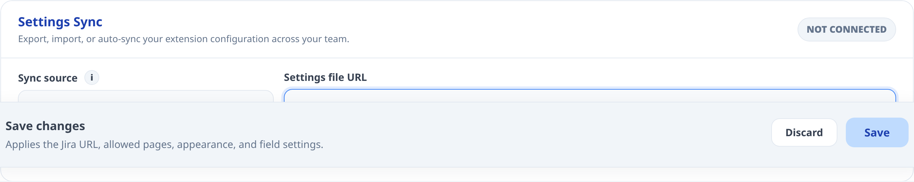

# Jira QuickView User Guide

> Hover Jira keys on GitHub, Gmail, Outlook, docs, and other enabled pages to inspect issues, follow linked PRs, comment, transition, and edit fields without opening a new Jira tab.

[Download Extension](https://chromewebstore.google.com/detail/jira-quickview/oddgjhpfjkeckcppcldgjomlnablfkia) · [Extension website](https://dgebaei.github.io/Jira-QuickView/) · [User guide](https://dgebaei.github.io/Jira-QuickView/user-guide.html) · [GitHub repository](https://github.com/dgebaei/Jira-QuickView) · [Issue tracker](https://github.com/dgebaei/Jira-QuickView/issues)

Jira QuickView lets you work with Jira issues directly from the web pages where issue keys appear. Instead of opening Jira in a separate tab for every notification, pull request, document, or checklist, you can hover an issue key and use the popup to inspect, update, comment on, and triage the issue.

The screenshots in this guide are examples. Your popup can look different depending on your Jira project, your permissions, your workflow, and the layout you choose in the Options page.

Table of contents

  <button type="button" class="user-guide-toc-toggle-all" data-toc-toggle-all aria-expanded="false">Expand all</button>

<nav class="user-guide-toc-list" aria-label="User guide sections">
  

    <a class="user-guide-toc-link" href="#1-what-jira-quickview-helps-you-do">1. What Jira QuickView Helps You Do</a>
  

  

    <a class="user-guide-toc-link" href="#2-before-you-start">2. Before You Start</a>
  

  

    <a class="user-guide-toc-link" href="#3-first-time-setup">3. First-Time Setup</a>
  

  

    <a class="user-guide-toc-link" href="#31-browser-compatibility-and-installed-web-apps">3.1 Browser Compatibility and Installed Web Apps</a>
  

  

    
4. Options Page

    <ul>
      <li><a href="#4-options-page">4. Options Page overview</a></li>
      <li><a href="#41-basic-connection">4.1 Basic: Connection</a></li>
      <li><a href="#42-basic-appearance">4.2 Basic: Appearance</a></li>
      <li><a href="#43-advanced-show-advanced-settings">4.3 Advanced: Show Advanced Settings</a></li>
      <li><a href="#44-advanced-hover-behavior">4.4 Advanced: Hover Behavior</a></li>
      <li><a href="#45-advanced-tooltip-layout-overview">4.5 Advanced: Tooltip Layout Overview</a></li>
      <li>
        <a href="#46-advanced-organizing-row-fields">4.6 Advanced: Organizing Row Fields</a>
        <ul>
          <li><a href="#461-custom-fields">4.6.1 Custom Fields</a></li>
        </ul>
      </li>
      <li><a href="#47-advanced-content-blocks">4.7 Advanced: Content Blocks</a></li>
      <li><a href="#48-advanced-settings-sync">4.8 Advanced: Settings Sync</a></li>
      <li><a href="#49-save-and-discard">4.9 Save and Discard</a></li>
    </ul>
  

  

    
5. Using the Popup Every Day

    <ul>
      <li><a href="#5-using-the-popup-every-day">5. Using the Popup Every Day overview</a></li>
      <li><a href="#51-where-the-popup-appears">5.1 Where the Popup Appears</a></li>
      <li><a href="#52-header-reporter-assignee-summary-and-actions">5.2 Header: Reporter, Assignee, Summary, and Actions</a></li>
      <li><a href="#53-quick-actions-menu">5.3 Quick Actions Menu</a></li>
      <li>
        <a href="#54-row-1-issue-type-status-priority-history-and-watchers">5.4 Row 1: Issue Type, Status, Priority, History, and Watchers</a>
        <ul>
          <li><a href="#541-history-panel">5.4.1 History Panel</a></li>
          <li><a href="#542-watchers-panel">5.4.2 Watchers Panel</a></li>
        </ul>
      </li>
      <li><a href="#55-row-2-epic-parent-sprint-affects-version-and-fix-version">5.5 Row 2: Epic, Parent, Sprint, Affects Version, and Fix Version</a></li>
      <li><a href="#56-row-3-environment-labels-and-custom-fields">5.6 Row 3: Environment, Labels, and Custom Fields</a></li>
      <li><a href="#57-description-block">5.7 Description Block</a></li>
      <li><a href="#58-time-tracking-block">5.8 Time Tracking Block</a></li>
      <li><a href="#59-attachments-block">5.9 Attachments Block</a></li>
      <li><a href="#510-pull-requests-block">5.10 Pull Requests Block</a></li>
      <li><a href="#511-comments-and-reactions">5.11 Comments and Reactions</a></li>
    </ul>
  

  

    
6. Troubleshooting

    <ul>
      <li><a href="#6-troubleshooting">6. Troubleshooting overview</a></li>
      <li><a href="#why-edit-buttons-or-options-appear-only-sometimes">Why Edit Buttons or Options Appear Only Sometimes</a></li>
      <li><a href="#the-popup-does-not-appear">The popup does not appear</a></li>
      <li><a href="#the-popup-appears-but-issue-data-does-not-load">The popup appears but issue data does not load</a></li>
      <li><a href="#a-field-cannot-be-edited">A field cannot be edited</a></li>
      <li><a href="#a-user-is-missing-from-assignee-search">A user is missing from Assignee search</a></li>
      <li><a href="#allowed-page-pattern-does-not-match">Allowed page pattern does not match</a></li>
    </ul>
  

  

    
7. Suggested Daily Workflows

    <ul>
      <li><a href="#7-suggested-daily-workflows">7. Suggested Daily Workflows overview</a></li>
      <li><a href="#triage-from-email">Triage from email</a></li>
      <li><a href="#review-a-pull-request">Review a pull request</a></li>
      <li><a href="#prepare-a-release">Prepare a release</a></li>
      <li><a href="#investigate-a-bug">Investigate a bug</a></li>
    </ul>
  

</nav>

## 1. What Jira QuickView Helps You Do

Jira QuickView is built for people who see Jira issue keys outside Jira all day: in Gmail, Outlook, GitHub, release notes, incident docs, QA checklists, internal dashboards, and team wikis.

With the extension, you can:

- Open a Jira issue preview by hovering an issue key such as `ABC-123`.
- See the issue summary, reporter, assignee, status, priority, versions, sprint, labels, description, comments, attachments, history, and linked pull requests.
- Update supported fields directly from the popup when Jira allows it.
- Add comments, mention teammates, react to comments, edit your own comments, and inspect attachment evidence.
- Customize which fields and content blocks appear in the popup.

## 2. Before You Start

Before Jira QuickView can show issue data, these things must be true:

- Jira QuickView must be installed from the Chrome Web Store: [Download Extension](https://chromewebstore.google.com/detail/jira-quickview/oddgjhpfjkeckcppcldgjomlnablfkia).
- Best support today is on desktop Chromium browsers such as Chrome, Edge, and Brave.
- You must be signed in to Jira in the same browser.
- The extension must know your Jira instance URL.
- The page where you want popups must be allowed in the Options page.

Jira QuickView uses your existing browser session. It does not store a separate Jira password. If your Jira instance requires VPN or company network access, the extension has the same requirement because the requests are still going from your browser to Jira.

## 3. First-Time Setup

1. Install Jira QuickView from the Chrome Web Store: [Download Extension](https://chromewebstore.google.com/detail/jira-quickview/oddgjhpfjkeckcppcldgjomlnablfkia).
2. Open the Jira QuickView Options page.
3. Enter your Jira instance URL, for example `https://your-company.atlassian.net`.
4. Add the pages where you want Jira issue popups to appear.
5. Choose your color mode, or keep `System`.
6. Click `Save`.
7. Open an allowed page and hover a Jira key.

If nothing happens after setup, check the troubleshooting section at the end of this guide. The most common causes are an unallowed page, a Jira URL typo, not being signed in to Jira, or using the hover modifier incorrectly.

### 3.1 Browser Compatibility and Installed Web Apps

Jira QuickView is a Chrome Web Store extension, so the best-supported setup is a desktop Chromium browser.

Recommended choices:

- `Chrome`: fully supported.
- `Microsoft Edge`: supported by installing the extension from the Chrome Web Store.
- `Brave`: supported by installing the extension from the Chrome Web Store.
- `Firefox`: not supported for Jira QuickView, even though recent Firefox for Windows builds can install sites as web apps.
- `Safari`: not supported for Jira QuickView, even though Safari on macOS can turn sites into web apps and can run Safari-specific extensions.

If your goal is Outlook or Gmail in an app-like window, use this order:

1. Install Jira QuickView in the browser.
2. Open the mail site in a normal tab and make sure Jira QuickView works there first.
3. Add the exact site domain to `Allowed pages`.
4. Only then install that site as a web app or app window if your browser supports it.

Useful allowed page examples for mail-based workflows:

- `mail.google.com`
- `outlook.office.com`
- `outlook.office365.com`
- `outlook.live.com`

#### Chrome

Use Chrome when you want the most direct setup and the clearest vendor documentation.

1. Open [Download Extension](https://chromewebstore.google.com/detail/jira-quickview/oddgjhpfjkeckcppcldgjomlnablfkia) in Chrome.
2. Click `Add to Chrome`, then confirm `Add extension`.
3. Open Jira QuickView Options and configure your Jira URL plus allowed pages.
4. Open Outlook or Gmail in a normal tab and verify that hovering a Jira key works.
5. If you want an app-style window, open the site, then use `More` > `Cast, save, and share` > `Install page as app...`.
6. If Chrome shows an install icon in the address bar for that site, you can use that shortcut instead.

What to expect:

- The installed site opens in its own window.
- Your normal Chrome profile, cookies, and signed-in Jira session still matter.
- If the popup works in a regular tab but not in the app window, re-check the exact domain in `Allowed pages`.

#### Microsoft Edge

Edge works well when you want installed web apps, especially for Outlook and Microsoft 365 pages.

1. Open the Chrome Web Store listing for Jira QuickView in Edge.
2. If Edge asks whether to allow extensions from other stores, click `Allow`.
3. Click `Get extension` or `Get`, then confirm `Add extension`.
4. Open Jira QuickView Options and configure your Jira URL plus allowed pages.
5. Open Outlook in a normal Edge tab and verify that hovering a Jira key works.
6. To install Outlook or another site as an app, open the site and use `Settings and more` > `More tools` > `Apps` > `Install this site as an app`.
7. You can manage installed apps later at `edge://apps`.

What to expect:

- Edge can install both true PWAs and ordinary websites as app windows.
- This is usually the smoothest option if your daily flow centers on Outlook on the web.

#### Brave

Brave supports nearly all Chromium-compatible extensions, so Jira QuickView can be installed from the Chrome Web Store there as well.

1. Open the Chrome Web Store listing for Jira QuickView in Brave.
2. Click `Add to Brave`, then confirm the install prompt.
3. Open Jira QuickView Options and configure your Jira URL plus allowed pages.
4. Open Outlook or Gmail in a normal Brave tab and verify that hovering a Jira key works.
5. If you want an app-like mail window, use Brave's site install, app shortcut, or open-as-window flow if your current Brave build exposes it.

What to know:

- Brave's extension support is strong because it is Chromium-based.
- Brave's installed-site UI changes more often than Chrome or Edge, so menu labels may differ by version.
- If your Brave build does not clearly offer an app-style install flow, keep using the site in a normal tab. Jira QuickView still works there.

#### Firefox

Firefox is not a supported Jira QuickView browser today.

What Firefox can do:

- Firefox for Windows can now install sites as web apps and pin them to the taskbar.

What Firefox cannot do for this project:

- Jira QuickView is not published as a Firefox add-on.
- The Chrome Web Store install flow does not apply to Firefox.

Practical guidance:

- If you only want Outlook as a web app window, Firefox may be acceptable on Windows.
- If you want Outlook or Gmail plus Jira QuickView, use Chrome, Edge, or Brave instead.

#### Safari

Safari is also not a supported Jira QuickView browser today.

What Safari can do:

- On macOS, Safari can turn a website into a web app with `Add to Dock`.
- Safari web apps can use Safari web extensions that are available through Apple's extension system.

What Safari cannot do for this project:

- Jira QuickView is not published as a Safari extension in the App Store.
- Installing the Chrome Web Store version will not work in Safari.

Practical guidance:

- If you want app-like Outlook or Gmail windows on macOS and also need Jira QuickView, use Chrome or Edge.
- Use Safari only if you are intentionally choosing Safari without Jira QuickView.

## 4. Options Page

The Options page controls where Jira QuickView runs and what the popup shows. Most users only need the Basic settings. Advanced settings are useful when you want tighter hover behavior, a team-specific popup layout, custom Jira fields, or a shared configuration file.

### 4.1 Basic: Connection

The Connection block tells Jira QuickView which Jira site to use and which websites can show the popup.

#### Jira instance URL

Enter the normal Jira address you use in the browser. Examples:

- `https://your-company.atlassian.net`
- `https://jira.your-company.com`

If you omit `https://`, Jira QuickView normalizes the value for you when possible. Still, the clearest setup is to paste the full address from your browser.

#### Allowed pages

Allowed pages decide where Jira QuickView is allowed to inject its popup. This protects you from having the extension run everywhere.

Simple examples:

- `github.com`
- `mail.google.com`
- `outlook.office.com`
- `docs.your-company.com`

Advanced examples:

- `https://github.com/your-org/*`
- `https://*.your-company.com/*`
- `https://wiki.your-company.com/projects/*`
- `<all_urls>`

Technical note: this field accepts comma-separated domains, full URLs, Chrome-style match patterns, and wildcard patterns using `*`. Internally, Jira QuickView normalizes these patterns and converts wildcards into regular-expression matching. It does not treat the field as arbitrary raw JavaScript regex syntax, so prefer `*` wildcards instead of writing regex metacharacters directly.

What to know:

- A simple domain such as `github.com` becomes a broad match for that domain.
- A full URL with a path can limit matching to that part of a site.
- Wildcards are useful for subdomains, for example `https://*.your-company.com/*`.
- The extension also asks Chrome for host permissions when you save. If you cancel the browser permission prompt, the settings may not apply.
- If this is your first save and no Jira URL was stored before, Jira QuickView also adds your Jira instance URL to the allowed pages list.

### 4.2 Basic: Appearance

The Appearance block controls the color mode for the Options page and popup.

Available modes:

- `System` follows your operating system or browser preference.
- `Light` keeps the extension in light mode.
- `Dark` keeps the extension in dark mode.

Most users should keep `System`. Use `Light` or `Dark` only if you want Jira QuickView to stay fixed regardless of your OS theme.

### 4.3 Advanced: Show Advanced Settings

The Advanced section is hidden by default so the setup page stays simple. Open it when you want to change how the popup is triggered, how its rows are arranged, which custom fields appear, or how to export/import settings.

Advanced settings are still safe to use, but they affect the day-to-day feel of the extension. If you are setting this up for a team, configure one browser first, test the popup on real work pages, then export the configuration for others.

### 4.4 Advanced: Hover Behavior

Hover Behavior controls when Jira QuickView opens the popup after your mouse is near a Jira issue key.

#### Trigger depth

Trigger depth controls how aggressively the extension searches surrounding page elements for Jira keys.

- `Exact` checks only the exact element under your mouse.
- `Shallow` checks the hovered element and its immediate parent.
- `Deep` walks up to 5 ancestor levels and is the most sensitive.

Use `Exact` if popups appear too often on dense pages. Use `Deep` if a site wraps issue keys in complex HTML and the popup does not reliably open.

#### Modifier key

Modifier key controls whether hovering alone is enough, or whether you must press a keyboard key after hovering.

- `None` opens the popup on hover.
- `Alt` opens it when you hover and then press `Alt`.
- `Ctrl` opens it when you hover and then press `Ctrl`.
- `Shift` opens it when you hover and then press `Shift`.
- `Any` opens it when you hover and then press `Alt`, `Ctrl`, or `Shift`.

Modifier keys are useful on pages with many Jira keys, such as inboxes and pull request pages. They prevent accidental popups while still keeping the issue one gesture away.

### 4.5 Advanced: Tooltip Layout Overview

Tooltip Layout controls the rows and content blocks inside the popup. The layout editor has two concepts:

- Fields are small chips placed in Row 1, Row 2, or Row 3.
- Content blocks are larger sections below the rows, such as Description, Pull Requests, Comments, Attachments, and Time Tracking.

The preview in the Options page shows the overall shape of the popup. It is not a live Jira issue. It helps you understand where fields will appear after saving.

What to know:

- Drag fields from `Available Fields` into Row 1, Row 2, or Row 3.
- Drag content blocks into the content area to show them in the popup.
- Remove a field or block if it is not useful for your team.
- Description is treated as the core issue content and is always represented in the content area by the current layout editor.
- Reporter, assignee, summary, copy, pin, quick actions, and close live in the popup header. They are explained in the popup section of this guide.

### 4.6 Advanced: Organizing Row Fields

The three popup rows are for compact issue facts. Use them to decide what a user should understand before reading the larger content blocks.

Suggested organization:

- Row 1 is for urgent triage data, such as Issue Type, Status, Priority, History, and Watchers.
- Row 2 is for planning and release data, such as Epic or Parent, Sprint, Affects Version, and Fix Version.
- Row 3 is for supporting context, such as Environment, Labels, and custom fields you add.

Good layouts keep the first row short and high-signal. If a field is useful only after initial triage, put it in Row 2 or Row 3. If a field is rarely used, remove it from the popup entirely or keep it in Jira.

Business logic and limitations:

- Issue type editing appears only when Jira says the field is editable and there is more than one valid issue type available.
- Status editing shows Jira workflow transitions, not every status in the project.
- Priority editing appears only when Jira exposes priority as editable for that issue.
- Epic/Parent depends on whether the issue uses Jira parent hierarchy or an Epic Link style field.
- Sprint support depends on Jira Agile fields being visible to the extension.
- Sprint editing appears only if Jira exposes a valid Sprint field and editable metadata for the issue.
- Version chips can link to Jira filters when there is exactly one version value. When multiple versions are present, the chip is still informative but may not be linked as narrowly.
- Environment editing appears only when Jira allows the `set` operation for that field.
- Labels editing requires both Jira edit permission and label suggestion support.
- Custom fields can be displayed even when they cannot be edited.
- Long text in chips can be truncated to keep the popup usable.
- Row chips can link to filtered Jira searches when the field value can be expressed as a useful JQL filter.

#### 4.6.1 Custom Fields

Custom fields let you add team-specific Jira fields to Row 1, Row 2, or Row 3. This is useful for fields like Customer Impact, Reviewer, Tempo Account, Severity, Component Owner, Release Train, or any other Jira field your team relies on.

How to add a custom field:

1. Open Advanced settings.
2. In Tooltip Layout, click `+ Add field`.
3. Enter the Jira field ID, for example `customfield_12345`.
4. Wait for Jira QuickView to validate the field name.
5. Save it and drag it into the row where you want it.
6. Click `Save` at the bottom of the Options page.

What to know:

- Jira field IDs are not always the same as field names. A field named `Customer Impact` might have an ID like `customfield_12345`.
- Jira QuickView validates custom fields by reading Jira's field catalog.
- Built-in fields such as `status`, `priority`, `assignee`, and `description` cannot be added again as custom fields.
- A custom field can be visible but not editable.

Custom field editing support:

- User fields and multi-user fields can use user search when Jira allows editing.
- Tempo Account fields can use account search when Jira exposes the right field metadata.
- Single-select and multi-select custom fields can be edited when Jira provides allowed values and the `set` operation.
- Simple single-value text-like fields can be edited as text or textarea when supported.
- Unsupported or permission-blocked fields are displayed as read-only chips.

### 4.7 Advanced: Content Blocks

Content blocks are larger sections under the popup rows. They are where you read and work with issue content.

Available blocks:

- Description
- Attachments
- Comments
- Pull Requests
- Time Tracking

How to use them:

- Keep blocks you use every day near the top.
- Remove blocks that create noise for your team.
- If your team mostly triages from email, Description and Comments are usually the most important.
- If your team reviews releases, Pull Requests, Attachments, and History are often more important.

Business logic and limitations:

- Attachments currently preview image attachments. Non-image files may still be linked from Jira or visible in history, but the visual attachment grid focuses on previewable images.
- Pull Requests appear only when Jira returns development-status data for the issue.
- Time Tracking appears when Jira exposes time tracking data or editable time tracking metadata.
- Comments appear when the content block is enabled. The composer follows your Jira permissions.

### 4.8 Advanced: Settings Sync

Settings Sync lets you move a Jira QuickView configuration between browsers or teammates.

Available actions:

- `Export (.json)` downloads the current configuration as a versioned JSON file.
- `Import (.json)` loads a previously exported file or Team Sync settings file into the Options page.
- The global `Save` button stores the Team Sync source in this browser and runs the first sync check.
- `Sync Now` runs a one-off sync against the current Team Sync fields without saving that source in the browser.
- `Disconnect` removes the saved Team Sync source from this browser.

Team Sync sources:

- `Jira attachment`: point the extension at one Jira issue key and one attachment filename.
- `Settings file URL`: point the extension at one HTTPS or HTTP URL that serves the JSON file.

What goes in the shared file:

- Team Sync reads a versioned JSON document like [jira-quickview-settings.json](https://github.com/dgebaei/Jira-QuickView/blob/master/docs/examples/jira-quickview-settings.json).
- The file must include `schemaVersion`, a top-level `settingsRevision` number such as `1`, `2`, or `3`, and a `settings` object.
- The current `Export (.json)` output already uses the Team Sync file format, so it is a good starting point for administrators publishing a shared file.
- The Team Sync source itself is still stored locally in the browser, not inside the shared settings file. Importing a file does not automatically connect the browser to a shared Jira issue or URL.

First-time setup for end users:

1. Open the extension Options page.
2. If your team uses `Jira attachment`, save your Jira instance URL first.
3. Open `Advanced` and find `Team Sync`.
4. Choose `Jira attachment` or `Settings file URL`.
5. Enter the shared Jira issue key and filename, or paste the shared URL.
6. Click the global `Save` button and accept the permission prompt if Chrome asks for it. Jira QuickView saves the Team Sync source in this browser and immediately runs the first sync check.

What users need from an administrator:

- For `Jira attachment`: the Jira issue key and the exact attachment filename.
- For `Settings file URL`: the direct URL to the JSON file.

Publishing updates:

- Keep the shared location stable. For Jira attachment mode, keep the attachment filename stable. For URL mode, keep the shared URL stable.
- Publish a new JSON file with a higher `settingsRevision`.
- For Jira attachment sync, upload the new file to the same issue with the same filename. Jira QuickView picks the newest matching attachment automatically, including Jira's duplicate-upload rename pattern.
- A sample file is available at [jira-quickview-settings.json](https://github.com/dgebaei/Jira-QuickView/blob/master/docs/examples/jira-quickview-settings.json).

Failure handling:

- If the source URL is wrong, the Jira issue key is invalid, the attachment is missing, or the JSON is invalid, the Team Sync panel shows an error.
- The last successfully applied team configuration stays active.
- When a later sync succeeds, the extension applies the newer revision automatically.

Important:

- Importing settings does not fully apply them until you click `Save`. This gives you a chance to review the Jira URL, allowed pages, layout, hover behavior, and custom fields before changing the active browser setup.
- `Save` still succeeds even if the first Team Sync fetch fails. Your local settings and Team Sync source are saved, the last good synced team configuration stays active, and the sync error remains visible in the Team Sync panel.

### 4.9 Save and Discard

The footer of the Options page applies or discards changes.

- `Save` writes the configuration to Chrome storage, requests any needed host permissions, refreshes the extension's page matching rules, and runs the first Team Sync check when Team Sync is configured.
- `Discard` reloads the Options page and drops unsaved changes.
- The status pill at the top of the page tells you whether there are unsaved changes or whether the current form matches the last saved state.
- Save notices in the footer report the save result. Team Sync errors stay in the Team Sync panel itself.

If custom fields are invalid, saving is disabled until the issue is fixed. This prevents a broken field ID from being saved accidentally.

## 5. Using the Popup Every Day

After setup, the normal flow is simple:

1. Open a page you allowed in Options.
2. Find a Jira key such as `ABC-123`.
3. Hover the key.
4. Press the configured modifier key if your settings require it.
5. Read or update the issue from the popup.

The popup uses your Jira permissions. If you can only view an issue in Jira, the popup will mostly be read-only. If you can edit the issue in Jira, supported edit controls may appear.

### 5.1 Where the Popup Appears

The popup appears on pages matched by your Allowed pages settings. Common places include:

- Jira notification emails in Gmail or Outlook on the web
- GitHub pull requests, issues, commits, and release notes
- Internal docs and wiki pages
- QA checklists
- Incident notes
- Release dashboards

The extension only looks for Jira issue keys on allowed pages. It does not scan every site you visit.

### 5.2 Header: Reporter, Assignee, Summary, and Actions

The header is the top part of the popup. It keeps the most common actions close together.

Header items:

- Reporter avatar shows who reported the issue.
- Assignee avatar shows who owns the issue. If Jira allows editing, you can click the edit control and search assignable users.
- Summary link opens the full Jira issue in a new tab.
- Summary edit lets you rename the issue when Jira allows the `summary` field to be changed.
- Copy copies the issue link.
- Pin keeps the popup open while you move the mouse.
- Quick actions opens Jira-backed shortcuts.
- Close hides the popup. `Esc` also closes it.

Business logic and limitations:

- Assignee search uses Jira assignable-user logic for the specific issue, so it should match who can actually be assigned.
- Summary editing appears only when Jira edit metadata says the summary field supports `set`.
- Quick actions appear only when at least one action is available.

### 5.3 Quick Actions Menu

Quick actions are shortcuts for common Jira updates.

Examples:

- Assign the issue to yourself.
- Move the issue to the next useful workflow state, such as starting progress.
- Move the issue to an active or upcoming sprint when Jira exposes a valid sprint field.

Business logic and limitations:

- Quick actions are not hardcoded guesses. They are built from the current issue, current user, Jira transitions, and available sprint data.
- `Assign to me` appears only when the current assignee is not already you and Jira can resolve your user identity.
- Start-progress style actions appear only when Jira exposes a matching transition.
- Sprint actions appear only when Jira exposes a sprint field and available active or future sprints.

### 5.4 Row 1: Issue Type, Status, Priority, History, and Watchers

Row 1 is the fastest read of the issue.

Default fields:

- Issue Type tells you whether this is a bug, task, story, sub-task, or another Jira type.
- Status tells you the current workflow state.
- Priority tells you the urgency or importance set in Jira.
- History opens a timeline of issue changes.
- Watchers shows how many people watch the issue and whether you are watching.

Business logic and limitations:

- Status edit options are Jira transitions from the current state, not a list of every possible project status.
- The Watchers count comes from Jira's watcher data.
- History data loads only when you open the history panel, which keeps the initial popup faster.

#### 5.4.1 History Panel

The History panel shows recent issue changes without opening Jira's full history page.

What you can see:

- Who changed the issue
- When the change happened
- Field changes, such as status, assignee, labels, versions, or custom fields
- Rich description or comment changes when available
- Attachment references connected to history entries

Business logic and limitations:

- Jira QuickView formats Jira changelog data into grouped entries.
- Rich text history may be summarized first, with expandable details for longer content.
- History is a view of Jira's recorded changelog. If Jira does not record a detail, Jira QuickView cannot invent it.
- Opening History closes Watchers if the Watchers panel is open, so the popup stays readable.

#### 5.4.2 Watchers Panel

The Watchers control shows how many people are watching the issue. Clicking it opens the Watchers panel.

What you can do:

- See who is watching the issue.
- Search for users to add as watchers.
- Remove watchers when Jira allows it.
- See whether you are currently watching the issue.

Business logic and limitations:

- Watcher search uses Jira user search and filters out people who are already watching.
- Add and remove actions use Jira's watcher APIs and your Jira permissions.
- If Jira blocks adding or removing a watcher, the panel shows an error and keeps the current list usable.
- Opening Watchers closes History if History is open.

### 5.5 Row 2: Epic, Parent, Sprint, Affects Version, and Fix Version

Row 2 is usually where planning and release information lives.

Common fields:

- Epic or Parent links the issue to larger work.
- Sprint shows the sprint or sprints associated with the issue.
- Affects Version shows where the problem or request applies.
- Fix Version shows the planned or delivered release.

Business logic and limitations:

- Parent editing depends on the hierarchy model Jira exposes for the issue.
- Sprint values can come from Jira Agile fields that vary by company and project.
- Version chips are most linkable when there is exactly one version.
- These fields can be moved to other rows in the layout editor if your team wants a different visual priority.

### 5.6 Row 3: Environment, Labels, and Custom Fields

Row 3 is good for context fields that are useful but usually less urgent than status or priority.

Common fields:

- Environment shows deployment, browser, device, customer, or test environment notes.
- Labels show Jira labels and can link to label-filtered Jira searches.
- Custom fields show team-specific data that you added in Options.

Business logic and limitations:

- Environment can be edited only when Jira says it is editable with the `set` operation.
- Labels can be edited only when Jira allows label updates and label suggestions are supported.
- Custom fields may show read-only values if their type is unsupported or Jira does not allow editing.

### 5.7 Description Block

The Description block shows the issue description. If Jira allows it, you can edit it directly in the popup.

What you can do:

- Read formatted issue details.
- Edit or add a description.
- Use simple formatting controls for bold, italic, underline, lists, and code blocks.
- Paste or attach images while editing.

Business logic and limitations:

- The edit button appears only when Jira says the description field supports the `set` operation.
- Save is disabled until something changes or uploads finish.
- If you close or switch issues while editing, draft attachment cleanup may run so abandoned uploads do not linger.
- Jira formatting support depends on how your Jira instance stores description content.

### 5.8 Time Tracking Block

The Time Tracking block lets you view estimates and log work from the popup when Jira exposes time tracking.

What you can do:

- View original estimate.
- View remaining estimate.
- View time spent.
- Log new work with amount, description, and date.
- Edit estimates when Jira allows it.

Business logic and limitations:

- Estimate inputs are disabled if Jira does not allow editing estimates on the current issue.
- Logging work can still be available even when estimate editing is not.
- Save is disabled until you change something.
- Accepted time formats depend on Jira, but common examples include values like `30m`, `1h`, or `2h 30m`.

### 5.9 Attachments Block

The Attachments block helps you inspect visual evidence without opening Jira.

What you can do:

- Preview image attachments.
- Open the full attachment in Jira.
- Use screenshot evidence during QA, release checks, bug triage, or support work.

Business logic and limitations:

- The visual grid focuses on image attachments that can be previewed in the popup.
- Non-image files may be linked or visible elsewhere, but they do not get the same image preview treatment.
- Attachment visibility follows your Jira permissions.

### 5.10 Pull Requests Block

The Pull Requests block shows development work connected to the Jira issue.

What you can see:

- Pull request title
- Author
- Branch
- Status
- Link to open the pull request

Business logic and limitations:

- Pull request data comes from Jira development-status APIs.
- If Jira does not know about linked pull requests, the block will not show them.
- The current browser page is filtered out when it is the same pull request you are already viewing, which avoids showing a redundant link.

### 5.11 Comments and Reactions

The Comments block lets you read and participate in Jira discussion from the popup.

What you can do:

- Read existing comments.
- Add a new comment.
- Type `@` to mention someone.
- Copy a direct comment link.
- Edit or delete your own comments when Jira allows it.
- Add supported reactions to comments.

Business logic and limitations:

- Comment permissions come from Jira.
- Mention search uses Jira user search around the current comment context.
- Comment reactions are shown only when the Jira instance supports the reaction flow used by the extension.
- Delete actions ask for confirmation inside the popup before applying the change.

## 6. Troubleshooting

### Why Edit Buttons or Options Appear Only Sometimes

Jira QuickView intentionally does not show edit controls unless Jira says the action is valid for the current issue.

This depends on:

- Your Jira permissions
- The issue's project
- The issue type
- The current workflow status
- Required fields and workflow validators
- Jira edit metadata for the field
- Available Jira transitions
- Whether a field type is supported by Jira QuickView's inline editor

Important examples:

- Status choices are workflow transitions from the current status. They are not every possible status in the project.
- Assignee choices are assignable users for the current issue, not every Jira user.
- Sprint editing requires a valid sprint field and Jira Agile metadata.
- Labels require label suggestion support.
- Custom fields can be displayed even when their type cannot be edited inline.

If an edit button is missing, it usually means one of two things: Jira does not allow the edit for that issue, or Jira QuickView can display the field but does not yet support editing that field type.

### The popup does not appear

Check these first:

- The current page is included in Allowed pages.
- You saved the Options page after changing settings.
- You are hovering an issue key in a recognizable format, such as `ABC-123`.
- You are pressing the configured modifier key after hovering, if a modifier is configured.
- You are signed in to Jira in the same browser.
- Your Jira instance is reachable from the browser.

### The popup appears but issue data does not load

Likely causes:

- Jira URL is wrong.
- Jira session expired.
- VPN or company network is disconnected.
- The issue key does not exist in your Jira instance.
- You do not have permission to view the issue.

### A field cannot be edited

This is usually expected. Jira QuickView honors Jira permissions, workflow rules, edit metadata, and supported field types. Try opening the issue in Jira itself. If Jira also prevents the edit there, the popup will not be able to do it either.

### A user is missing from Assignee search

Assignee search is issue-specific. Jira may allow a person to watch an issue but not allow that person to be assigned to it. If Jira's own assignee picker shows the user and Jira QuickView does not, capture the exact Jira request URL from the browser Network tab and include it in a bug report. That URL helps compare Jira's own filtering with the popup's filtering.

### Allowed page pattern does not match

Use simple values first:

- `github.com`
- `mail.google.com`
- `outlook.office.com`

Then move to specific patterns:

- `https://*.your-company.com/*`
- `https://docs.your-company.com/projects/*`

Remember that wildcard patterns use `*`. Do not write raw regex syntax unless you have verified how Chrome permissions and Jira QuickView normalization will treat it.

## 7. Suggested Daily Workflows

### Triage from email

1. Open a Jira notification in Gmail or Outlook.
2. Hover the issue key.
3. Check status, priority, assignee, description, comments, and watchers.
4. Assign to yourself, comment, or transition the issue if needed.

### Review a pull request

1. Open a GitHub pull request that mentions a Jira key.
2. Hover the key.
3. Check Jira status, linked PRs, comments, attachments, and history.
4. Update status or comment without leaving the pull request.

### Prepare a release

1. Hover each issue key in a release checklist.
2. Check fix version, status, linked PRs, attachments, and comments.
3. Use History to verify recent changes.
4. Update missing fields or comments before shipping.

### Investigate a bug

1. Hover the bug's issue key from a QA note or support page.
2. Read the description, environment, labels, attachments, and comments.
3. Use History to understand recent changes.
4. Add findings as a comment or update the description if Jira allows it.
